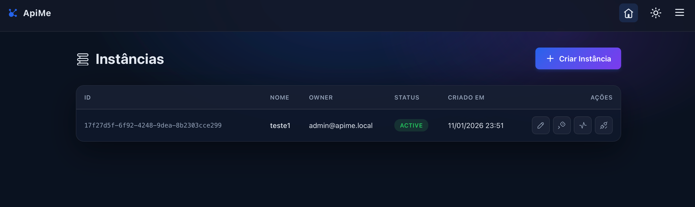

Api em Go para orquestrar múltiplas instâncias. 

Baseada na biblioteca [WhatsMeow](https://github.com/tulir/whatsmeow) com dashboard e eventos via Webhooks.



1. **Configurar o ambiente:**
   ```bash
   cp .env.example .env
   ```
   *(Edite o `.env` conforme necessário).*

2. **Iniciar os containers:**
   ```bash
   docker compose up -d
   ```
   **Importante:** As migrations e o usuário administrador inicial são criados automaticamente no primeiro boot.

## Acesso

- **Dashboard:** `http://localhost:8080/dashboard`
- **Email:** `admin@apime.local`
- **Senha:** `admin123`


- **API Specification:** `openapi.yaml`
- **Documentação:** docs/


## ❤️ Apoie o projeto

Se o **apime** te ajudou, contribua com o desenvolvimento:

### 🇧🇷 Pix (Brasil)


- **Chave Aleatória:** `b5b1510a-b738-4640-b374-7ed2d16163a4`

### ₿ Bitcoin (BTC)
- **Endereço:** `1PR1ciDQ6wTLJ2WfCDE2AcXb4uAac1HbyQ`

